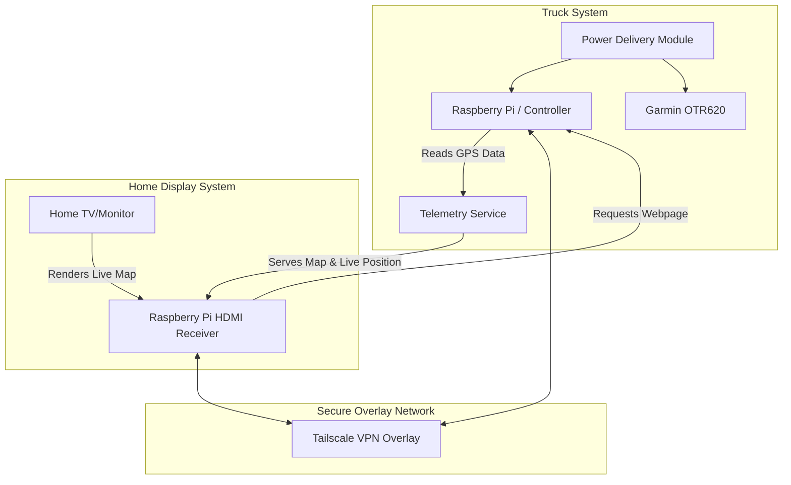

# Truck GPS Mount & Telemetry System (`truck-gps`)

A modular, parametric mount for the upper dash cubby in a **2022 Volvo VNL 860**, designed for a **Garmin OTR620** GPS, with integrated accessory shelves, real-time telemetry, and smart controller-based cooling/lighting.

This repository, formerly specific to the OTR620, has been restructured into a generic **`truck-gps`** project to host both mechanical (STL/CAD) files and software (Raspberry Pi/telemetry) code.

---

## Documentation Index

- [README.md](README.md): Project overview, directory structure, system architecture, and electrical planning.
- [docs/todo.md](docs/todo.md): Master planning, task tracking, measurements, and physical test records.
- [docs/chats.md](docs/chats.md): Historical session logs (v0.1, v0.2, and v0.3) preserving earlier design rationale and prompts.
- [docs/tomtom-api.md](docs/tomtom-api.md): TomTom Orbis Map, Routing, and Traffic API free tier and integration details.
- [docs/google-maps-api.md](docs/google-maps-api.md): Google Maps Platform free tier, Essentials, and Pro API configurations.

---

## Repository Structure

```
truck-gps/
├── README.md               # Main project file
├── docs/                   # Documentation, specifications, and notes
│   ├── todo.md             # Master task list and physical checklists
│   ├── chats.md            # Conversation archive from design sessions
│   ├── tomtom-api.md       # TomTom Orbis & legacy Maps pricing/specs
│   └── google-maps-api.md  # Google Maps pricing and capability reference
└── src/                    # Source code and physical designs
    ├── pi/                 # Python/C code, telemetry, Tailscale configs, and system scripts
    └── stl/                # 3D printer files (OpenSCAD & STLs grouped by design versions)
        ├── v0.1/           # First-generation design files
        ├── v0.2/           # Second-generation design files
        └── v0.3/           # V3.1 parametric mount & coupon test models
```

---

## System Architecture: Telemetry & Home Map

The truck has a stable **Starlink Wi-Fi** network, allowing the in-cab system to connect to the internet in real time.



### Tracking Workflow:
1. **Telemetry & GPS Capture:** The in-cab Raspberry Pi reads real-time GPS coordinates.
2. **Tailscale Private Network:** Both the truck Raspberry Pi and the home Raspberry Pi are enrolled in a private **Tailscale** network. This eliminates public IP exposure and port-forwarding issues.
3. **Home Display:** A Raspberry Pi connected to a TV/monitor at home loads a local webpage hosted by the truck Raspberry Pi via its Tailscale IP address.
4. **Real-time Map:** The page displays a high-resolution map of Canada and the United States with a custom truck icon representing your live location.
5. **Historical Logs:** The system logs traveled distance (km/miles) and states/provinces/countries visited per calendar year.
6. **Live Traffic:** The map consumes real-time traffic alerts using **TomTom Orbis Traffic** or **Google Maps** APIs on their generous free tiers.

---

## Power Strategy: Single vs. Dual USB-C Input

The front of the mounting bracket will feature physical toggle switches/buttons allowing manual control over individual power lines:
- **Main Power** (Master cut-off)
- **GPS Power**
- **Blue LEDs Power**
- **Cooling Fan Power**

We have evaluated two power routing topologies for the back of the bracket:

### Option A: Single USB-C Cable (Recommended)
* **Description:** A single USB-C PD (Power Delivery) source powers the entire bracket. An internal buck converter regulates the input down to stable 5V lines.
* **Pros:**
  * Clean single-cable aesthetic behind the bracket.
  * Easy routing down the Volvo VNL dash.
  * Simplified physical plug-in sequence.
* **Cons:**
  * Requires robust internal step-down circuitry (e.g., converting 9V/12V PD to 5V @ 4A).
  * High-power charging (AirPods + GPS + Fan + Pi) could introduce electrical noise or heat.
  * Single point of failure for the entire system.

### Option B: Dual USB-C Cables
* **Description:** One USB-C cable runs directly to the Garmin GPS, while a second USB-C cable powers the Raspberry Pi and auxiliary components separately.
* **Pros:**
  * Complete isolation of the Garmin GPS from the experimental Pi/LED/Fan circuitry.
  * No custom internal power management or high-power step-down converters needed.
  * If the Pi hangs or crashes, the GPS remains fully powered and functional.
* **Cons:**
  * Looks cluttered with two separate cables exiting the back of the bracket.
  * Uses up two USB power outlets in the truck's dashboard area.

---

## Controller Comparison: Pi Pico 2W vs. Pi Zero 2W

To achieve telemetry and automation, we compare the ideal candidate boards:

| Feature | Raspberry Pi Pico 2W (RP2350) | Raspberry Pi Zero 2W (BCM2710A1) |
|---|---|---|
| **Category** | Microcontroller | Single Board Computer (SBC) |
| **Operating System** | No OS (Bare-metal, RTOS, MicroPython) | Linux (Ubuntu Server, Raspberry Pi OS) |
| **Tailscale Support** | No native client (Very difficult/non-standard) | Fully supported (Standard Linux Debian client) |
| **Development** | C/C++ or MicroPython | Python, Node.js, standard web servers |
| **Boot Time** | Instant (< 1 second) | 15-30 seconds |
| **Power Consumption** | Extremely low (< 50mW) | Moderate (0.5W to 2.0W) |
| **Web Hosting** | Extremely limited | Full features (Lightweight Nginx, Flask, or FastAPI) |
| **SSH Access** | No standard SSH (Console over serial/USB) | Standard OpenSSH out of the box |
| **Verdict** | **Ideal for low-power sensor/LED/fan control only.** | **Highly recommended for telemetry, Web Hosting, Tailscale, and SSH.** |

### Architectural Recommendation
To support **Tailscale**, **SSH access**, and a **Live Map Web Server** over Starlink, a **Raspberry Pi Zero 2W** (or standard Pi) is the superior choice for the in-cab brain. It can handle GPS telemetry parsing, interface with the Starlink Wi-Fi, run the Tailscale client, host the map page, and still control the LEDs, switches, and fans via its GPIO header.

---

## Technical Specifications

### Garmin OTR620 Physical Baseline
* **Nominal Size:** 152.4 × 86.4 × 18.0 mm
* **Pocket Dimensions:** 153.8 × 87.8 × 19.0 mm
* **Mounting Type:** Secure gasketed front faceplate with 4x M2 × 6 mm screws and standard M2 nuts.
* **Operating Voltage:** 5V at up to 2A peak (Provisional target; to be verified on device label).

### Accessory Mounts (V3.1 Shelf)
* **AirPods Pro 3 Mount:** Angled at 45° for visual access, designed around a Latercase cover. Can support a wired short right-angle USB-C cable or an embedded magnetic wireless charging puck.
* **PopSocket Mount:** Custom oval pocket designed around a MagSafe PopSocket base. Includes a recess for a 55mm OD / 43mm ID steel target ring for magnetic retention.

---

## Active Cooling & Thermal Management

To keep the Garmin OTR620 and the internal electronics cool during operation under direct sunlight, we will integrate an active cooling loop using a **Noctua NF-A4x10 5V** fan (40 × 40 × 10 mm).

```
          [ Hot Air Exhaust Vents ] (Mirrors bottom aesthetic)
                     ▲
                     │
         ┌───────────────────────┐
         │     Garmin OTR620     │
         └───────────────────────┘
                     ▲
                     │  (Air drawn over unit)
         ┌───────────────────────┐
         │ Noctua 40x40x20mm Fan │ <--- Thicker 20mm 4-Pin PWM Fan at back
         └───────────────────────┘
                     ▲
                     │
          [ Cool Air Intake Vents ] (Dual-purpose sound/intake vents)
```

### Thermal Design Principles:
1. **Vertical Airflow Loop:** Air is pulled in through the intake vents at the bottom of the bracket, drawn upwards over the hot surfaces of the GPS housing and the controller board, and exhausted through matching air vents at the top of the bracket.
2. **Symmetrical Aesthetic:** The top exhaust vents will be geometrically modeled to mirror the bottom sound duct vents on the face of the bracket, providing visual balance.
3. **Internal Fan Mounting:** The fan will be mounted in a dedicated 40x40mm recess at the back of the main bracket body (within the ~29.8 mm lower cavity). 
4. **Thickness Clearances:** The fan is **20 mm thick**, which offers significantly higher static pressure and cooling efficiency at very low noise levels compared to the 10 mm model. We allow a **22 mm deep envelope** in the bracket design to accommodate the vibration-damping silicone pads included with Noctua fans. This guarantees no direct plastic-to-fan mechanical contact, eliminating cabin buzz/rattling.
5. **Isolating Acoustic Paths:** The cooling path will remain separate from the dedicated speaker return duct to prevent fan static pressure from interfering with GPS voice navigation audio.

### Automated Fan Control & Temperature Sensing

To prevent the fan from running constantly at full blast (minimizing dust accumulation and ensuring a near-silent cabin), the in-cab Raspberry Pi will automatically scale the speed of the **Noctua NF-A4x20 5V PWM** fan dynamically based on real-time ambient housing temperature.

#### 1. Sensor Selection: DS18B20 (Digital 1-Wire)
* **Why DS18B20?** It is an extremely common, cheap, and robust digital sensor. It communicates over a single data line (Dallas 1-Wire protocol), requiring only **one GPIO pin** on the Raspberry Pi. Unlike analog sensors (which require an ADC chip because the Pi lacks analog input pins), the DS18B20 outputs high-precision digital readings directly.
* **Alternative (DHT22):** Measures both temperature and humidity, but is physically much larger and more difficult to position discreetly behind the GPS compartment.

#### 2. Electrical Wiring Schematics (Ultra-Simplified)

By choosing a **4-pin PWM fan (NF-A4x20 5V PWM)**, we **completely eliminate** the need for external MOSFET low-side switches, flyback diodes, or gate resistors. Standard 4-pin fans feature an integrated speed controller on the fan's motor circuit board. The PWM control line (blue wire) can be driven **directly** by a 3.3V GPIO pin from the Raspberry Pi.

```
                      [ Pi 5V Rail (Pin 2/4) ]
                                │
                                ├─── [ Fan Pin 2: VCC (Red) ]
                                │
                  [ Pi 3.3V ]   │
                       │        │
                 [4.7kΩ PullUp] │
                       │        │
      [GPIO 4] ────────┼─ (DQ)  │
                    DS18B20     │
      [GND]    ───────── (GND)  │
                                │
                      [ Pi GND (Pin 6/9) ]
                                │
                                ├─── [ Fan Pin 1: GND (Black) ]
                                │
      [GPIO 18] ────────────────┴─── [ Fan Pin 4: PWM (Blue) ]

      *(Optional - Fan Pin 3: Tachometer (Green) can be left disconnected)
```

* **DS18B20 Hookup:**
  * **VDD** connects to **3.3V** (Pin 1 or 17).
  * **GND** connects to **Ground** (Pin 6, 9, etc.).
  * **DQ (Data)** connects to **GPIO 4** (Pin 7).
  * **Pull-up Resistor:** A **4.7kΩ resistor** must be placed between the **3.3V (VDD)** and **GPIO 4 (DQ)** lines.
* **PWM 4-Pin Fan Hookup:**
  * **Pin 1 (Black):** Connects to **Pi Ground (GND)**.
  * **Pin 2 (Red):** Connects to **Pi 5V Power**.
  * **Pin 3 (Green - Tachometer / Speed feedback):** Optional. Can be left floating or wired to a GPIO with a pull-up if RPM monitoring is desired.
  * **Pin 4 (Blue - PWM Speed Control):** Connects **directly to GPIO 18** (Pin 12 - Pi Hardware PWM pin). No external components needed.

#### 3. Software Control Logic (Dynamic PWM Speed Ramping)

Rather than turning simple ON/OFF, the Python controller script adjusts the speed of the fan dynamically. It runs quiet at low temperatures, ramps up as the truck dash gets warmer under direct sunlight, and only goes to full speed if temperatures spike:

* **Under 35°C (95°F):** Fan is OFF (0% Duty Cycle).
* **35°C to 45°C (95°F to 113°F):** Fan speed scales linearly from a quiet **30% speed up to 100% speed**.
* **Over 45°C (113°F):** Fan runs at full throttle (**100% speed**).

```python
import os
import time
import RPi.GPIO as GPIO

# Configuration
PWM_PIN = 18          # Hardware PWM pin on Pi (GPIO 18 / Pin 12)
PWM_FREQ = 25000      # 25kHz is the target PWM frequency for Noctua fans
TEMP_MIN = 35.0       # Temp at which the fan starts turning (30% duty cycle)
TEMP_MAX = 45.0       # Temp at which the fan hits full speed (100% duty cycle)
CHECK_INTERVAL = 5    # Check temperature every 5 seconds

# Setup GPIO
GPIO.setmode(GPIO.BCM)
GPIO.setup(PWM_PIN, GPIO.OUT)

# Initialize PWM on Pin 18
fan_pwm = GPIO.PWM(PWM_PIN, PWM_FREQ)
fan_pwm.start(0)  # Start at 0% duty cycle

# Locating the DS18B20 1-wire directory
W1_DIR = "/sys/bus/w1/devices/"
try:
    sensor_folder = [f for f in os.listdir(W1_DIR) if f.startswith("28-")][0]
    sensor_file = os.path.join(W1_DIR, sensor_folder, "w1_slave")
except IndexError:
    print("Error: No DS18B20 sensor found!")
    sensor_file = None

def read_temp_raw():
    if not sensor_file: return ""
    with open(sensor_file, "r") as f:
        return f.readlines()

def read_temp():
    lines = read_temp_raw()
    while lines[0].strip()[-3:] != "YES":
        time.sleep(0.2)
        lines = read_temp_raw()
    equals_pos = lines[1].find("t=")
    if equals_pos != -1:
        temp_string = lines[1][equals_pos+2:]
        return float(temp_string) / 1000.0
    return 0.0

try:
    print("Automatic Dynamic Thermal PWM System Active...")
    
    while True:
        current_temp = read_temp()
        print(f"Current GPS Compartment Temp: {current_temp:.2f}°C")
        
        # Calculate speed based on temperature
        if current_temp < TEMP_MIN:
            duty_cycle = 0
        elif current_temp >= TEMP_MAX:
            duty_cycle = 100
        else:
            # Linear scaling between 30% and 100% duty cycle
            temp_fraction = (current_temp - TEMP_MIN) / (TEMP_MAX - TEMP_MIN)
            duty_cycle = 30 + int(temp_fraction * 70)
            
        print(f"Setting Fan PWM Speed: {duty_cycle}%")
        fan_pwm.ChangeDutyCycle(duty_cycle)
        time.sleep(CHECK_INTERVAL)

except KeyboardInterrupt:
    print("Shutting down thermal service...")
finally:
    fan_pwm.stop()
    GPIO.cleanup()
```

---

## Next Planning Phases
1. **Mechanical Prototyping:** 3D print the V3.1 coupon tests and verify Volvo VNL cubby fit, M2 nut recesses, and Garmin housing dimensions.
2. **Power Hardware Selection:** Choose between a Single USB-C 12V PD buck board or separate dual cords.
3. **Telemetry & Software PoC:**
   * Configure a Raspberry Pi Zero 2W with Tailscale and connect it to truck Starlink Wi-Fi.
   * Write a lightweight service in Python to process GPS NMEA data sentences.
   * Design a simple dashboard map using TomTom Orbis Web SDK / API.
