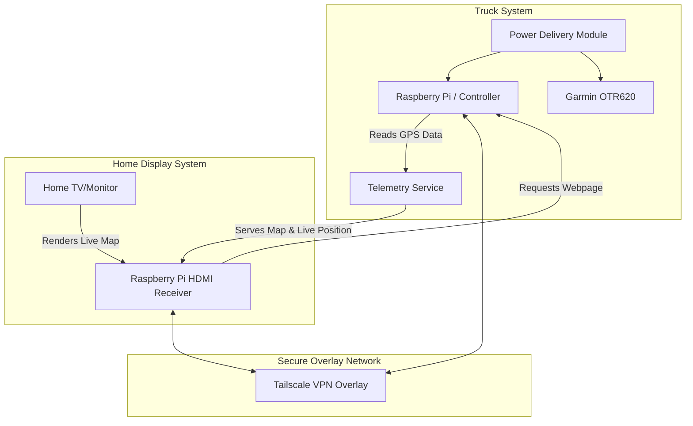

# Truck GPS Mount & Telemetry System (`truck-gps`)

A modular, parametric mount for the upper dash cubby in a **2022 Volvo VNL 860**, designed for a **Garmin OTR620** GPS, with integrated accessory shelves, real-time telemetry, and smart controller-based cooling/lighting.

This repository, formerly specific to the OTR620, has been restructured into a generic **`truck-gps`** project to host both mechanical (STL/CAD) files and software (Raspberry Pi/telemetry) code.

---

## Documentation Index

- [README.md](README.md): Project overview, directory structure, system architecture, and electrical planning.
- [docs/todo.md](docs/todo.md): Master planning, task tracking, measurements, and physical test records.
- [docs/chats.md](docs/chats.md): Historical session logs (v0.1, v0.2, and v0.3) preserving earlier design rationale and prompts.
- [docs/tomtom-api.md](docs/tomtom-api.md): TomTom Orbis Map, Routing, and Traffic API free tier and integration details.
- [docs/google-maps-api.md](docs/google-maps-api.md): Google Maps Platform free tier, Essentials, and Pro API configurations.

---

## Repository Structure

```
truck-gps/
├── README.md               # Main project file
├── docs/                   # Documentation, specifications, and notes
│   ├── todo.md             # Master task list and physical checklists
│   ├── chats.md            # Conversation archive from design sessions
│   ├── tomtom-api.md       # TomTom Orbis & legacy Maps pricing/specs
│   └── google-maps-api.md  # Google Maps pricing and capability reference
└── src/                    # Source code and physical designs
    ├── pi/                 # Python/C code, telemetry, Tailscale configs, and system scripts
    └── stl/                # 3D printer files (OpenSCAD & STLs grouped by design versions)
        ├── v0.1/           # First-generation design files
        ├── v0.2/           # Second-generation design files
        └── v0.3/           # V3.1 parametric mount & coupon test models
```

---

## System Architecture: Telemetry & Home Map

The truck has a stable **Starlink Wi-Fi** network, allowing the in-cab system to connect to the internet in real time.



### Tracking Workflow:
1. **Telemetry & GPS Capture:** The in-cab Raspberry Pi reads real-time GPS coordinates.
2. **Tailscale Private Network:** Both the truck Raspberry Pi and the home Raspberry Pi are enrolled in a private **Tailscale** network. This eliminates public IP exposure and port-forwarding issues.
3. **Home Display:** A Raspberry Pi connected to a TV/monitor at home loads a local webpage hosted by the truck Raspberry Pi via its Tailscale IP address.
4. **Real-time Map:** The page displays a high-resolution map of Canada and the United States with a custom truck icon representing your live location.
5. **Historical Logs:** The system logs traveled distance (km/miles) and states/provinces/countries visited per calendar year.
6. **Live Traffic:** The map consumes real-time traffic alerts using **TomTom Orbis Traffic** or **Google Maps** APIs on their generous free tiers.

---

## Power Strategy: Single vs. Dual USB-C Input

The front of the mounting bracket will feature physical toggle switches/buttons allowing manual control over individual power lines:
- **Main Power** (Master cut-off)
- **GPS Power**
- **Blue LEDs Power**
- **Cooling Fan Power**

We have evaluated two power routing topologies for the back of the bracket:

### Option A: Single USB-C Cable (Recommended)
* **Description:** A single USB-C PD (Power Delivery) source powers the entire bracket. An internal buck converter regulates the input down to stable 5V lines.
* **Pros:**
  * Clean single-cable aesthetic behind the bracket.
  * Easy routing down the Volvo VNL dash.
  * Simplified physical plug-in sequence.
* **Cons:**
  * Requires robust internal step-down circuitry (e.g., converting 9V/12V PD to 5V @ 4A).
  * High-power charging (AirPods + GPS + Fan + Pi) could introduce electrical noise or heat.
  * Single point of failure for the entire system.

### Option B: Dual USB-C Cables
* **Description:** One USB-C cable runs directly to the Garmin GPS, while a second USB-C cable powers the Raspberry Pi and auxiliary components separately.
* **Pros:**
  * Complete isolation of the Garmin GPS from the experimental Pi/LED/Fan circuitry.
  * No custom internal power management or high-power step-down converters needed.
  * If the Pi hangs or crashes, the GPS remains fully powered and functional.
* **Cons:**
  * Looks cluttered with two separate cables exiting the back of the bracket.
  * Uses up two USB power outlets in the truck's dashboard area.

---

## Controller Comparison: Pi Pico 2W vs. Pi Zero 2W

To achieve telemetry and automation, we compare the ideal candidate boards:

| Feature | Raspberry Pi Pico 2W (RP2350) | Raspberry Pi Zero 2W (BCM2710A1) |
|---|---|---|
| **Category** | Microcontroller | Single Board Computer (SBC) |
| **Operating System** | No OS (Bare-metal, RTOS, MicroPython) | Linux (Ubuntu Server, Raspberry Pi OS) |
| **Tailscale Support** | No native client (Very difficult/non-standard) | Fully supported (Standard Linux Debian client) |
| **Development** | C/C++ or MicroPython | Python, Node.js, standard web servers |
| **Boot Time** | Instant (< 1 second) | 15-30 seconds |
| **Power Consumption** | Extremely low (< 50mW) | Moderate (0.5W to 2.0W) |
| **Web Hosting** | Extremely limited | Full features (Lightweight Nginx, Flask, or FastAPI) |
| **SSH Access** | No standard SSH (Console over serial/USB) | Standard OpenSSH out of the box |
| **Verdict** | **Ideal for low-power sensor/LED/fan control only.** | **Highly recommended for telemetry, Web Hosting, Tailscale, and SSH.** |

### Architectural Recommendation
To support **Tailscale**, **SSH access**, and a **Live Map Web Server** over Starlink, a **Raspberry Pi Zero 2W** (or standard Pi) is the superior choice for the in-cab brain. It can handle GPS telemetry parsing, interface with the Starlink Wi-Fi, run the Tailscale client, host the map page, and still control the LEDs, switches, and fans via its GPIO header.

---

## Technical Specifications

### Garmin OTR620 Physical Baseline
* **Nominal Size:** 152.4 × 86.4 × 18.0 mm
* **Pocket Dimensions:** 153.8 × 87.8 × 19.0 mm
* **Mounting Type:** Secure gasketed front faceplate with 4x M2 × 6 mm screws and standard M2 nuts.
* **Operating Voltage:** 5V at up to 2A peak (Provisional target; to be verified on device label).

### Accessory Mounts (V3.1 Shelf)
* **AirPods Pro 3 Mount:** Angled at 45° for visual access, designed around a Latercase cover. Can support a wired short right-angle USB-C cable or an embedded magnetic wireless charging puck.
* **PopSocket Mount:** Custom oval pocket designed around a MagSafe PopSocket base. Includes a recess for a 55mm OD / 43mm ID steel target ring for magnetic retention.

---

## Next Planning Phases
1. **Mechanical Prototyping:** 3D print the V3.1 coupon tests and verify Volvo VNL cubby fit, M2 nut recesses, and Garmin housing dimensions.
2. **Power Hardware Selection:** Choose between a Single USB-C 12V PD buck board or separate dual cords.
3. **Telemetry & Software PoC:**
   * Configure a Raspberry Pi Zero 2W with Tailscale and connect it to truck Starlink Wi-Fi.
   * Write a lightweight service in Python to process GPS NMEA data sentences.
   * Design a simple dashboard map using TomTom Orbis Web SDK / API.
